# Architecture Diagram


Bilding a portfolio site with next.js and pushing the code to github which will then deploy the website to AWS via AWS Amplify.


### Current situation/Challenge faced
Many portfolios show limited capabilities such as..
- Slow manual deployment processes
- Basic hosting
- Lack of automatic updates with changes
- Static sites missing full-stack capabilities


### Goal 
Deploy a portfolio website to showcase skills and experience with cloud technologies in AWS. I will keep this project live and running so that I can showcase my cloud skills to real life users.

**Will learn**
- Modern web development with Next.js
- AWS Amplify deployment workflows
- CI/CD best practices
- Cloud-native portfolio development
- Infrastructure as Code concepts

### Tasks
1. Create modern Portfolio Site
2. Configure AWS Amplify with CDK
3. Test and deploy

# Our Project Journey Documentation

# 1. Setting Up Next.js Project
**1. Create Project Folder** 
- I chose to name my folder 'amplify-portfolio-nextjs'. We do that by running the below command:
```bash
mkdir amplify-portfolio-nextjs
```
- 'mkdir' stands for 'make directory'. Directory is our folder that will be made, 'mkdir' is followed by what we name the folder.

**2. Create Next.js Application**
- Run the following command:
```bash
npx create-next-app@latest portfolio --typescript --tailwind
```

This command creates a new Next.js application with specific configurations. Here's what each part does:

npx - Node Package Manager, used to run the command
create-next-app@latest - Uses the latest version of Next.js's official scaffolding tool to generate a new project
portfolio - Names your project "portfolio" (this will be the folder name)
--typescript - Sets up the project with TypeScript instead of plain JavaScript
--tailwind - Preconfigures Tailwind CSS for styling

These are configuration prompts that appeared when we ran the create-next-app command. These let you customize the Next.js project setup (screenshot at the bottom):

✔ Which linter would you like to use? › ESLint - Asks which code linting tool to use. ESLint checks your code for errors and style issues. You selected ESLint (the standard choice).
✔ Would you like to use React Compiler? … No / Yes - Asks if you want to enable React's experimental compiler for automatic optimization. This is a newer feature.
✔ Would you like your code inside a src/ directory? … No / Yes - Asks if you want your application code organized in a src/ folder (more structured) or at the root level (simpler structure).
✔ Would you like to use App Router? (recommended) … No / Yes - Asks which routing system to use. App Router is Next.js's newer, more powerful routing system (vs. the older Pages Router).
✔ Would you like to customize the import alias @/* by default)? … No / Yes - Asks if you want to use @/ as a shortcut for imports (e.g., import Button from '@/components/Button' instead of import Button from '../../components/Button').

The last line:
Creating a new Next.js app in /Users/travonmayo/Documents/portfolio-projects/amplify-portfolio-nextjs/portfolio.
This confirms where your project is being created on your computer - in the portfolio folder at that file path.


### What this created
- Some key directories were created after these commands, such as:

- **Public:** Holds the static files such as images/files which are served directly

- **src/app:** SRC (source) is the source directory, app is the app root directory

- **layout.ts:x** The site's root layout

- **page.tsx:** The site's homepage

- **package.json:** Where the project dependencies are located


### Run the app
- We then finish push the app by running:
```bash
npm run dev
```

**🚨IMPORTANT🚨**
- Ensure that you move to the correct directory or else you will get an error.
- To change to your 'portfolio' directory run:
```bash
cd portfolio
```
- Forgot to do this and received an error. However, after moving to the correct directory I was able to get the correct output.

- Notice the output for the local host and network. 'Local' is the 'localhost' that can be entered in the URL browser to view the results of what was built by Next.js, while 'Network' represents the ip adress that is assigned to the local host.


**RESULTS OF **npm run dev'**
- After entering the localhost 3000 into the URL browser, we see the following landing page for the app:


- Next, I must create a front-end UI development to make the landing page appealing to the audience. Since I am not a front end developer, I asked myself what would be a unique way to have acheive our task of creating a front end despite my minimal experience with such a skill?

- I decided to adapt with the times and ask AI for some assistance with creating a front end UI for my site. While there are many AI options to use, but I decided to use Claude to acheive this. Although AI is being used, it is myself that is still creating and managing the infrastructure for the site. Without my knowledge of building the infrastructure, this UI is practically usless as it would have nothing to host it or ensure that users can access it. I think this is a great example of how to use AI as a tool rather than relying on AI.

**Updating the page.tsx template***

- After generating a new template for the portfolio site, I personalized the site to highlight my projects and skills. once the changes to the template were saved, the local host automatically updates witht the changes made. It now shows my name, a short bio about myself, projects that I've done and Links to connect with me on Github, LinkedIn and Gmail.


### Setup Github repository

- I created a new github repository and decided to name it 'Amplify-Portfolio', When we push our code to Github, it will automatically deploy the code to AWS Amplify, which will then deploy the resources into the infrastructure that Amplify creates. AWS Amplify will need access to this repository to our IAC, and in order for it to do that we must give Amplify access to the repository.

- To give Amplify access to the repo, I created Github personal access tokens. To create these tokens, you:

**1. Go to Settings**
- Click on the profile (top-right corner) and click 'Settings'

 

**2. go to Developer Settings**
- Scroll down and click on 'Developer Settings' (Left-hand side)


**3. Generate Token**
- Click 'Personal access tokens' 
- Click 'Tokens (classic)'
- Click 'Generate New Token' 
- Click 'Generate new token (classic) For general use' 


**4. Set the scope of the access token**
- Select the entire scope labeled 'Repo'. 
- Repo provides full control over the repository such as: Access to commit and deploy status, public repositories, repository invitations and read/write security events.


- Select the entire scope labeled 'admin:repo_hook'
- This scope provides full access to repository hooks such as writting and reading the repo hooks.
- Then complete generating the token


- After the token is created, a code will be displayed. This is the token's code and must be copied and stored somewhere as this code will not show again after leaving the page, however this code witll be needed later.


**5. Push Portfolio directory to Github**

Now that the tokens are setup the portfolio directory must be pushed to github. To do so run the commands:

```bash
git init

git add portfolio

git commit -m 'first commit'

git push -u origin main
```

After running those series of commands the portfolio folder will show in the github repository.

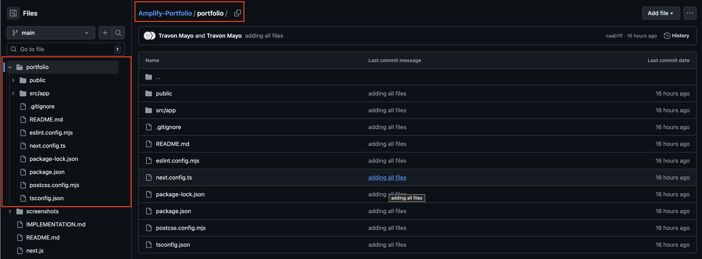


# 2. Setting up the CDK Infrastructure and Secrets Manager

### Create a new directory

When managing both application code and Infrastructure code, it is best practice to create a seperate directory from the application code. To do so we must:

Change our directory to the main portfolio directory which we have named 'amplify-portfolio-projects':
```bash
cd amplify-portfolio-nextjs
```

Make a new directory for the CDK code:
```bash
mkdir portfolio-infrastructure
```

Change to the new directory for the CDK code:
```bash
cd portfolio-infrastructure
```

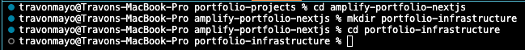

### Initiate CDK in terminal

Run the following code:
```bash 
cdk init app --language typescript
```

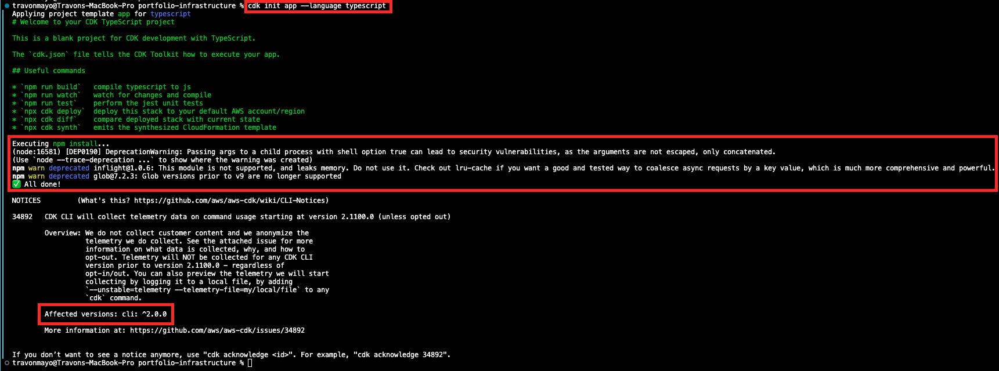

### New folders created from the Init

After innitializing the directory will show new folders/files within itself.

You will see:
- The 'bin' folder which acts as the entry point the Infrastructure code
- The 'Lib' folder which contains the 'portfolio-infrastructure-stack' that defines what the desired build is (the blueprint)
- The 'cdk.json' file that contains the settings that tells cdk how to run our code.

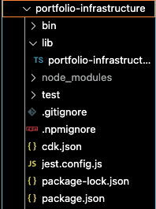

### Install Additional Packages

We must install the following packages so that CDK will be able to work with Amplify:

```bash
npm install @aws-cdk/aws-amplify-alpha aws-cdk-lib constructs
```

### 🚨ERROR🚨
After running the command I ran into an issue, I received the below error:

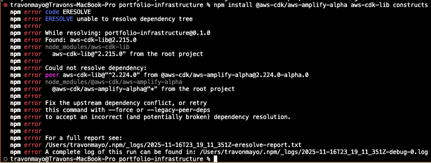

### The Problem

This is a version conflict error. Here's what's happening:

- The project currently has aws-cdk-lib@2.215.0 installed
- The package attempting to be installed (@aws-cdk/aws-amplify-alpha) requires aws-cdk-lib@^2.224.0 (version 2.224.0 or higher)
- Version 2.215.0 is older than the required 2.224.0, so npm is blocking the installation

### The Solution

- Upgrade aws-cdk-lib to the latest version first:
```bash
npm install aws-cdk-lib@latest
```
- Then install the Amplify package:
```bash
npm install @aws-cdk/aws-amplify-alpha
```

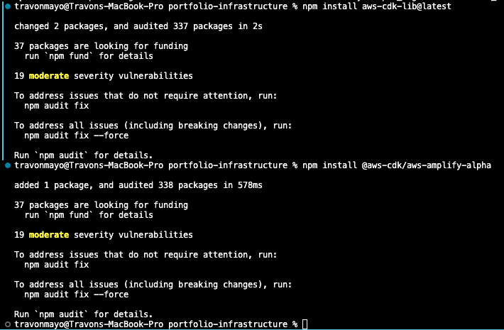

After installing the latest version, we are now ready to start building using CDK

### Configure Github Token

We need to securely store the Github token that was generated when setting up the repository

**1. Configure AWS CLI**
```bash
aws configure
```

**2. Create Secret with AWS Secret Manager**
```bash
aws secretmanager create-secret --name github-token --description "github token for Amplify" --secret-string "xxxxxxxxxxxxxxxxxxxxx"
```
**Upon Successful Creation you will receive the output:**
```bash
"ARN": "xxxxxxxxxxxxxxxxxxxxxxxxxxxxxxxxxxxxxxxxxxxxxx", # <-- Your ARN
    "Name": "github-token",
    "VersionId": "xxxxxxxxxxxxxxxxxx" # <-- Your version ID
```

### Ensure Secret is stored in AWS
When visiting the AWS console we now see that the token has successfully been stored in AWS Secrets MAnager


When clicking on the token additional details showup, other tabs are available for settings such as key rotation settings, token versions, replication and tags.

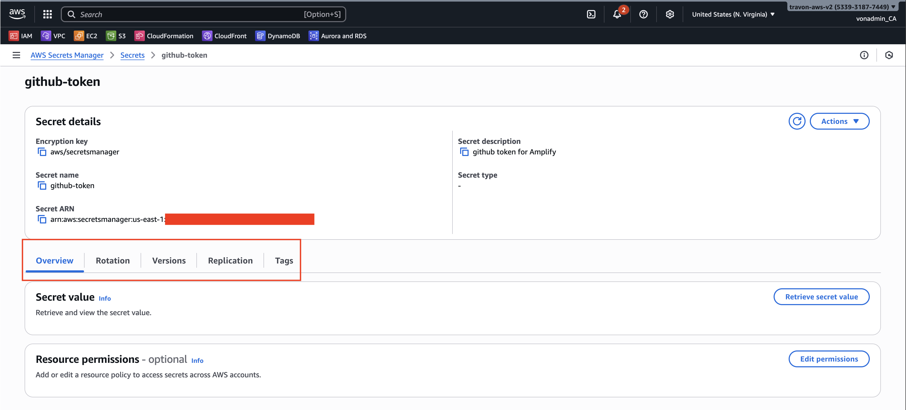

### Define CDK Infrastructure As Code (IAC)

This CDK code creates an AWS Amplify application that:
Connects to your GitHub repository
Automatically builds your Next.js portfolio when you push code
Deploys the built static files to Amplify hosting
Uses caching to speed up subsequent builds utilizes Amplify which automaWe 

We have built the below CDK code:

```typescript
import * as cdk from 'aws-cdk-lib';
// Imports the main AWS CDK library - gives access to core CDK features like Stack, SecretValue, etc.

import * as amplify from '@aws-cdk/aws-amplify-alpha';
// Imports AWS Amplify constructs - provides the tools to create Amplify apps and configurations

import * as codebuild from 'aws-cdk-lib/aws-codebuild';
// Imports AWS CodeBuild library - used to define build specifications for compiling your app

import { Construct } from 'constructs';
// Imports Construct class - the base class for all CDK constructs (building blocks)

export class PortfolioInfrastructureStack extends cdk.Stack {
// Defines your infrastructure stack class - extends (inherits from) the base CDK Stack class

  constructor(scope: Construct, id: string, props?: cdk.StackProps) {
  // Constructor function that runs when the stack is created
  // - scope: parent construct that contains this stack
  // - id: unique identifier for this stack
  // - props: optional configuration properties

    super(scope, id, props);
    // Calls the parent Stack class constructor to initialize the stack

    // Amplify Application
    const amplifyApp = new amplify.App(this, 'PortfolioApplication', {
    // Creates a new Amplify App resource
    // - 'this' refers to the current stack
    // - 'PortfolioApplication' is the logical ID in CloudFormation

      appName: 'Portfolio',
      // Sets the display name for your Amplify app in the AWS console

      // Connect to my github repo
      sourceCodeProvider: new amplify.GitHubSourceCodeProvider({
      // Configures GitHub as the source code provider

        owner: 'vonongit',
        // Your GitHub username

        repository: 'Amplify-Portfolio',
        // The name of your GitHub repository

        oauthToken: cdk.SecretValue.secretsManager('github-token')
        // Retrieves the GitHub personal access token from AWS Secrets Manager
        // This token allows Amplify to access your private repository
      }),

      // Build Specification
      buildSpec: codebuild.BuildSpec.fromObjectToYaml({
      // Defines the build instructions - converts JavaScript object to YAML format

        version: '1.0',
        // Specifies the Amplify build specification version

        frontend: {
        // Section for frontend build configuration

          phases: {
          // Defines different phases of the build process

            preBuild: {
            // Commands to run BEFORE building the app

              commands: [
                'echo "starting this build"',
                // Prints a message to the build log

                'cd portfolio',
                // Changes directory into the 'portfolio' folder

                'npm install'
                // Installs all Node.js dependencies listed in package.json
              ],
            },

            build: {
            // Commands to run during the BUILD phase

              commands: [
                'echo "building our nextjs app..."',
                // Prints a message to the build log

                'npm run build-and-export',
                // Runs the custom script to build and export your Next.js app

                'echo "build is completed"'
                // Prints completion message to the build log
              ],
            },
          },

          artifacts: {
          // Specifies which files to deploy after building

            baseDirectory: 'portfolio/out',
            // The folder containing the built files to deploy

            files: ['**/*'],
            // Pattern matching all files and subdirectories to include
          },

          cache: {
          // Configures caching to speed up future builds

            paths: [
              'node_modules/**/*',
              // Caches all installed npm packages

              '.next/cache/**/*'
              // Caches Next.js build cache for faster rebuilds
            ]
          }
        }
      })
    });

    const mainBranch = amplifyApp.addBranch('main', {
    // Adds the 'main' branch to the Amplify app for deployment

      autoBuild: true
      // Enables automatic builds when code is pushed to the main branch
    });
  }
}
```

# 3. Test And Deploy

**1. Changed to "portfolio-infrastructure" folder**
```bash
cd portfolio-infrastructure
```

**2. Deploy CDK Infrastructure**
```bash
cdk bootstrap

cdk deploy
```

**🚨Error🚨**
After running 'cdk deploy' I received an error.
- Found that I had the 'owner' and 'repository' values incorrect from the Amplify App construct. Make sure these match the name of your username and repository:

```typescript
// 🚨 Incorrect Naming 🚨
owner: 'Vonongit',
        // My actual github username is 'vonongit' with a lowercase 'v'

        repository: 'portfolio',
        // My actual repository name is 'Amplify-Portfolio'

// ✅ Correct Naming ✅
owner: 'vonongit',
        // My Actual GitHub username

        repository: 'Amplify-Portfolio',
        // My actual GitHub repository name
```

- Once I made those corrections CDK successfully deployed:

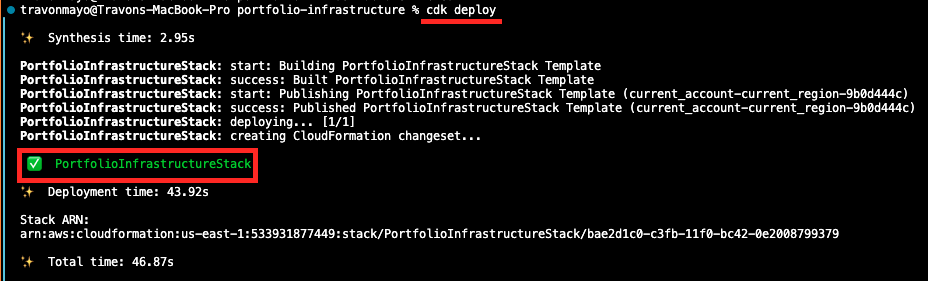

**3. Check Project on Amplify**

- Login to AWS Console and open AWS Amplify

**🚨 Issue 🚨**

- Found that an update is required:

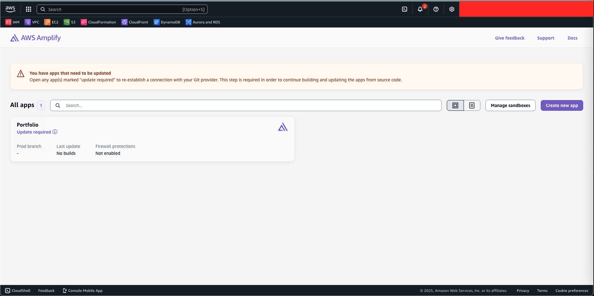

**✅ Resolution ✅**
- To resolve, I clicked on the "Portfolio" app, after doing so I was presented the following screen and clicked on "start migration":

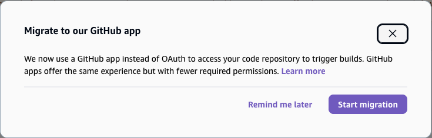

- After doing so I had to complete Authentication
- Also had to select the correct single repository to couple with Amplify

The migration was a success:

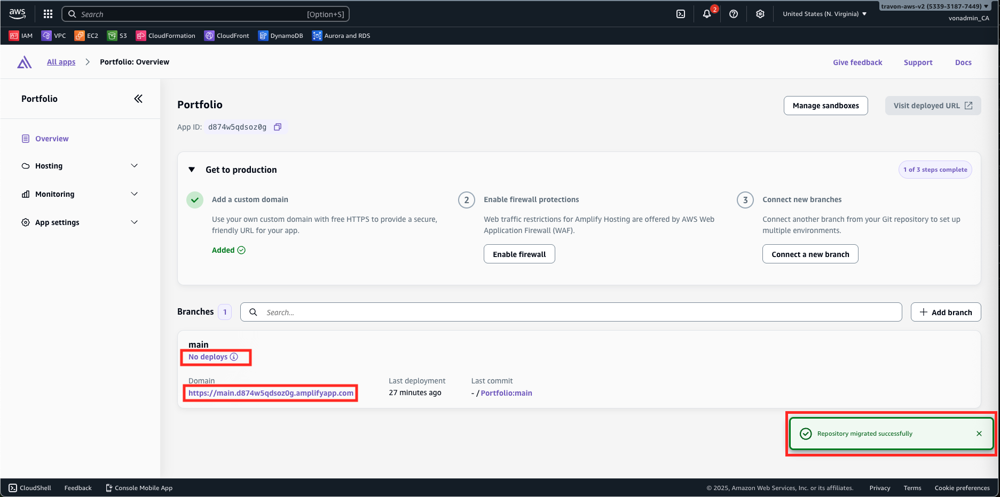

I tried following the app domain which provided me this:

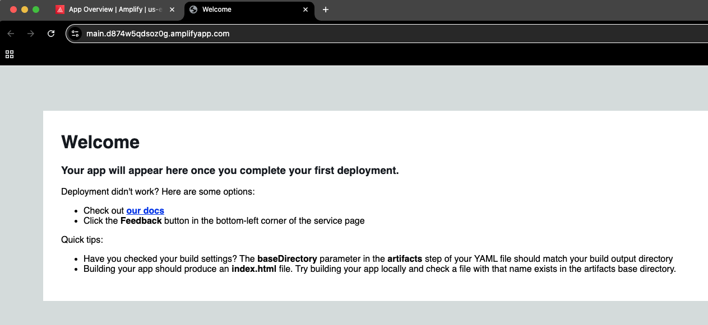

I then went back to open the app, and was able to click on "Run Job" to and execute the CDK infrastructure:

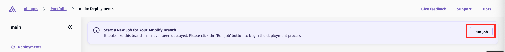

**🚨 ERROR 🚨**

- During build deployment, log stated the following:
```bash
npm error Missing script: "build-and-export"

npm error

 npm error To see a list of scripts, run:

npm error   npm run
```

**✅ THE SOLUTION: Add the Build Script ✅**

**1. Navigate to Navigate to your portfolio project (the Next.js app, not the CDK infrastructure)**
```bash 
cd ~/Documents/portfolio-projects/amplify-portfolio-nextjs/portfolio
```
**2. Open package.json (Vscode)** 
```bash
code package.json
```

**3. Find the "scripts" section and add the build-and-export script:**
```json
{
  "scripts": {
    "dev": "next dev",
    "build": "next build",
    "start": "next start",
    "lint": "next lint",
    "build-and-export": "next build" // <-- Add this
  }
}
```

**4. Update next.config.ts (or next.config.js) to enable static export:**
```typescript
import type { NextConfig } from "next";

const nextConfig: NextConfig = {
  output: 'export',  // Add this line for static export
};

export default nextConfig;
```

**5. Commit and push these changes to GitHub:**
```bash
git add package.json next.config.ts
git commit -m "Add build-and-export script and enable static export"
git push
```

### Re-run the code
After making the changes, once we run the code again we get a successful deployment:

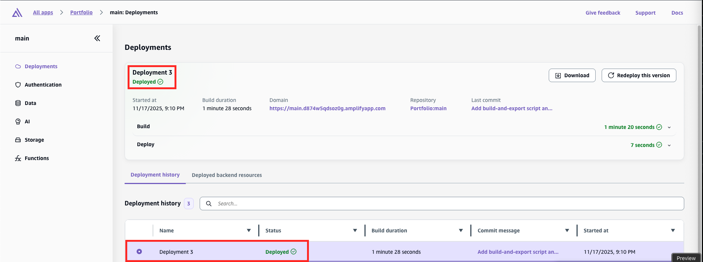


# Register Domain Name with Route 53
Lastly I registered a domain name for the portfolio site, reason being it is easier for a client to follow the site. The default link is "https://main.d874w5qdsoz0g.amplifyapp.com". That is much harder to remember than a simpler domain name such as "travonsportfolio.com", so our goal is to create a simple domain name that viewers can follow.

**1. Go to Route 53**

Select the option that says "Register a Domain"


**2. Check Domain Availability**

Search for your desired domain name, I wanted to use "travonsportfolio.com", this was priced at $15/year. This is a great value for a low traffic site that will need to run for a long time.

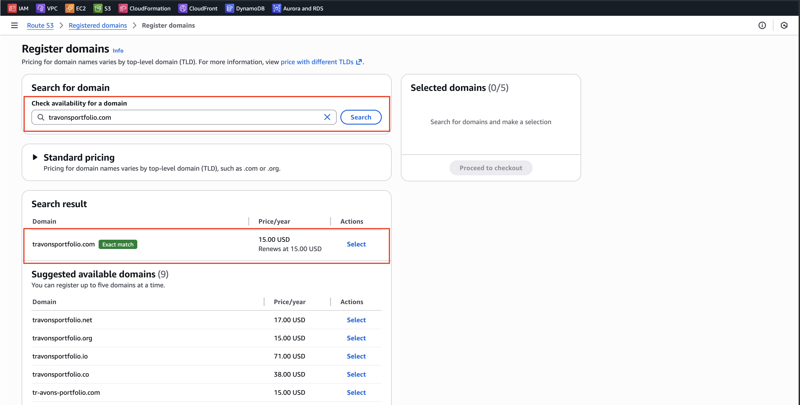

After purchasing it will take a couple minutes to create the domain, you can check progress in the "Requests" tab, once completed you will then see the domain show up in the "registered domains" section. 

**3. View Hosted Zone**

A hosted Zone has also been created, A hosted zone is basically a container for DNS records that tells the internet how to find your website. 

**When someone types travonsportfolio.com into their browser:**

Browser asks: "Where is travonsportfolio.com?"
Route 53 hosted zone answers: "It's at Amplify's servers!"
Browser connects to Amplify and loads your site

The hosted zone stores all the DNS records that make this possible.

**For the Amplify site, the hosted zone would contain:**

- Record pointing travonmayo.com → Amplify's servers
- Record pointing www.travonmayo.com → Amplify's servers
- SSL certificate validation records

**4. Connect Domain with Amplify**
- To associate Amplify with a domnain, must do the following:

**Go to custom domains** 
- In the Amplify Console, click "Hosting" → "Custom Domains"

**Add domain**
- Click on "Add Domain"
- The Route 53 domain created earlier automatically shows
- Select that Route 53 domain, and click "configure domain"
- Set both "https://travonsportfolio.com" and "https://www.travonsportfolio.com" to the main branch
- Leave the Amplify Managed SSL option selected
- I chose to check the box for the option "setup redirect from https://travonsportfolio.com to https://www.travonsportfolio.com"
- Lastly click the button "Add Domain"

**Add Your Domain**
- Click the "Add domain" button (orange button in top right)
- Select "Use a Route 53 domain"
- From the dropdown, select "travonsportfolio.com"
- Click "Configure domain"

**Configure Subdomains**
- Amplify will show options like:
✓ travonsportfolio.com → main branch
✓ www.travonsportfolio.com → main branch

✅ Keep both checked (root domain + www)
✅ Leave "Redirect www to root domain" checked
This way both URLs work and redirect to the same site
- Click "Save"

**Wait for Amplify to Configure (5-10 minutes)**
Amplify will now automatically:
- Create DNS records in Route 53 hosted zone
- Request an SSL certificate from AWS Certificate Manager
- Validate the certificate
- Configure CloudFront distribution
- Set up HTTPS redirects

The following statuses will show:
⏳ "Creating SSL certificate"
⏳ "Verifying certificate"
✅ "Available" (when done!)

**5. Test the Domain**
**Test in browser:**
https://travonsportfolio.com
https://www.travonsportfolio.com
```

Both should load the portfolio! 🎉

---

## What Amplify Just Did Behind the Scenes

**In the Route 53 Hosted Zone:**
- Added A record pointing to CloudFront
- Added CNAME for www subdomain
- Added certificate validation records

**In AWS Certificate Manager:**
- Provisioned free SSL certificate
- Auto-renewal enabled

**In Amplify App:**
- Mapped domain to your main branch
- Enabled HTTPS redirect
- Connected CloudFront distribution

---

## Final Setup:
```
User types: travonsportfolio.com
    ↓
Route 53 Hosted Zone (DNS lookup)
    ↓
CloudFront Distribution (CDN)
    ↓
AWS Amplify (Your site)
    ↓
Next.js Portfolio Loads! 🎉


# 💰 Total Cost 📊:
For 1 hosted zone with your domain:

Domain registration: $13/year (one-time annual)
Hosted zone: $6/year ($0.50/month)
DNS queries: ~$0.10/year (negligible)
Security features: $0 (included free)

**Grand Total: ~approx $19/year for AWS-managed DNS**

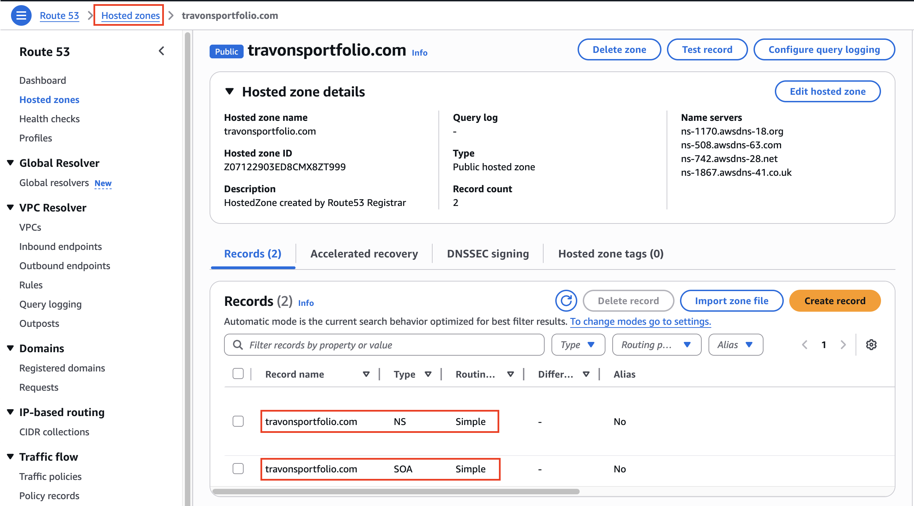

# Conclusion

While exploring deployment options for this portfolio, I carefully considered the trade-offs between AWS Amplify and a traditional S3 + CloudFront setup. 
- The S3 + CloudFront approach would have offered significant cost savings—potentially 50-70% less at around $1-5/month compared to Amplify's $5-15/month—along with more granular control over the infrastructure. 
- I was genuinely tempted by this option, especially given the opportunity to demonstrate cost optimization skills and hands-on experience with foundational AWS services. 
- However, I ultimately chose AWS Amplify for a few compelling reasons: its streamlined CI/CD pipeline eliminated the need to configure GitHub Actions or CodePipeline manually.
- Its built-in preview environments would support future development workflows, and most importantly, it allowed me to focus on building and iterating quickly rather than managing infrastructure complexity. 
- For a portfolio site where rapid deployment and modern full-stack practices take priority over cost optimization, Amplify proved to be the right choice—though I recognize that for production applications at scale, the cost difference would make S3 + CloudFront the more practical solution.

# Fuutre Considerations

- In the future, I may update this design and switch to an S3 -> Cloudfront model depending on costs
- However this is expected to handle low traffic, I will evaluate and determine whether the cost is worth the amount of traffic being met.


## 🤝 Connect With Me

<div align="center">

[](mailto:travondm2@gmail.com)
[](https://github.com/vonongit)
[](https://www.linkedin.com/in/travon-mayo/)

</div>

---

<div align="center">

**⭐ If you found this project helpful, please consider giving it a star!**

*This was a learning project based on a real-world scenario from Cloud Engineer Academy.*

</div>